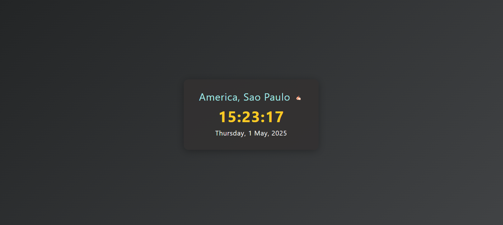
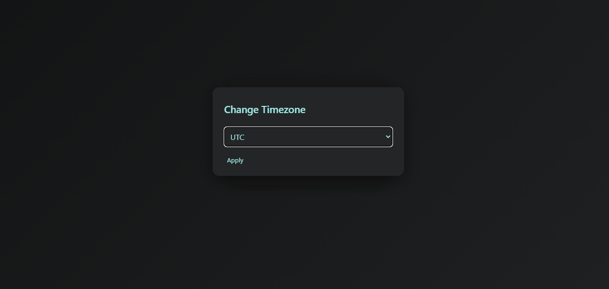

# Timezones Watch

A simple web app to display the current time and date in various timezones, with a modern UI and timezone selection modal.

## Features

- Displays current time and date for a selected timezone
- Supports popular global timezones
- Change timezone via a modal dialog
- Responsive and stylish design
- Built with [Vite](https://vitejs.dev/), [Day.js](https://day.js.org/), and [Micromodal](https://micromodal.vercel.app/)

## Getting Started

### Prerequisites

- [Node.js](https://nodejs.org/) (v14 or newer recommended)
- [npm](https://www.npmjs.com/)

### Installation

1. Clone this repository:

   ```sh
   git clone <your-repo-url>
   cd <project-directory>
   ```

2. Install dependencies:

   ```sh
   npm install
   ```

### Running the App

Start the development server:

```sh
npm run dev
```

Open your browser and go to [http://localhost:5173](http://localhost:5173) (or the URL shown in your terminal).

### Building for Production

```sh
npm run build
```

Preview the production build:

```sh
npm run preview
```

## Project Structure

- [`index.html`](index.html): Main HTML file
- [`main.js`](main.js): App logic (timezone, modal, time updates)
- [`style.css`](style.css): App styles
- [`src/`](src/): Vite starter files (not used in main app)

## Images





## Dependencies

- [dayjs](https://www.npmjs.com/package/dayjs) (with timezone and UTC plugins)
- [micromodal](https://www.npmjs.com/package/micromodal)
- [vite](https://vitejs.dev/)

## License

MIT

---

Made with ❤️ for learning and fun!